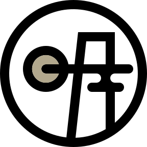

<div align="center">

<picture>
  <source media="(prefers-color-scheme: dark)" srcset="app/img/logo.svg">
  
</picture>

# mixoswatch

Cross-media color swatches for **2D commercial print**, **screen**, and **3D color printing** (Mimaki 3DUJ, Stratasys J55, Cura material libraries). Every swatch routed through a real CMYK ICC profile, not naive subtractive math.

### [→ Open the live site](https://mixocreative.github.io/mixoswatch/)


</div>

---

## What's in the box

- **`app/mixo-swatch.html`** (Mixo Swatch) · live grid of every CMYK value at a chosen step, rendered through a CMYK ICC profile of your choice. Filter by total area coverage, by named-color closeness (Japanese traditional + Chinese traditional + W3C CSS), by **dE max** for round-trip safety, build palettes, export ASE / GPL / PNG / JSON / ZIP. Hue × Light sort renders an 18 × 10 bucket map inline in the full grid area. **3D-print preset** is a one-way force button: it auto-lights when current settings already satisfy every 3D-print requirement (Color mode = Print / D50, TAC ≤ 240%, dE ≤ 2.0, Mimaki 3DUJ-safe profile); clicking while off force-fits all four at once; clicking while on is a no-op (move a slider or change profile to leave the envelope and the indicator auto-untoggles). Interface localised to **English / 日本語 / 繁體中文** with browser-language auto-detect + an in-app language picker, and a topbar **light / dark theme toggle** (defaults to dark on first run, OS `prefers-color-scheme` is intentionally ignored).
- **`index.html`** · zen landing with live interactive demos for every sidebar control, tri-lingual (EN / 日本語 / 繁中).

## Why

LLM color tools default to naive `R = 255 × (1 − C/100) × (1 − K/100)` math, which is what every web "CMYK picker" does. That math is fiction. The same CMYK ink mix prints differently on a Japanese coated press, a US web coated, a FOGRA39 sheet, and a Mimaki 3DUJ. mixoswatch routes every color through a real ICC profile (the same files prepress tools and FOSS RIPs load), so what you see on screen matches what the press will actually produce. No surprises at the proof stage.

For full color theory + pipeline rationale see **`ARCHITECTURE.md`** (the contract document).

## Repository layout

```
mixoswatch/
├── index.html                      Zen landing (tri-lingual, live demos)
├── app/
│   └── mixo-swatch.html            Mixo Swatch (live CMYK explorer)
├── scripts/
│   └── gen_luts.py                 Build CMYK↔sRGB lookup tables from ICCs
├── data/
│   ├── corpora/
│   │   └── name_corpora.json       Named-color dictionaries (committed)
│   ├── ui_defaults.json            Factory defaults (committed)
│   └── luts/                       Generated, gitignored
│       ├── index.json              Profile manifest
│       ├── *.lut                   Forward CMYK → sRGB (17⁴, ~250 KB each)
│       └── *.rcmyk.lut             Reverse sRGB → CMYK (17³, ~20 KB each)
├── icc/                            Gitignored: you supply your own .icc / .icm
├── README.md                       This file
├── ARCHITECTURE.md                 Full pipeline + rationale
└── .gitignore
```

## ICC profiles are not bundled

Adobe / ECI / Mimaki / Fogra all distribute their CMYK ICC profiles under licenses that do not allow redistribution. `icc/` is `.gitignore`d and you bring your own.

Free, common sources:

| Profile | Where to get it |
|---|---|
| `CoatedFOGRA39.icc` (recommended baseline) | [Adobe ICC Profiles bundle](https://www.adobe.com/support/downloads/iccprofiles/) → extract → `CMYK Profiles/CoatedFOGRA39.icc` |
| `ISOcoated_v2_eci.icc` | [ECI offset profiles](https://www.eci.org/doku.php?id=en:colourstandards:offset) |
| `JapanColor2001Coated.icc` | Adobe ICC Profiles bundle |
| `USWebCoatedSWOP.icc` | Adobe ICC Profiles bundle |
| `Mimaki 3DUJ` profile | Mimaki Profile Master 3 (MPM3), or by request from Mimaki support |

Drop them into `icc/` and run the build commands below.

---

## Quickstart

```bash
# 1. Install the only Python dependency.
python -m pip install --upgrade Pillow

# 2. Drop one or more CMYK ICC profiles into icc/.

# 3. Build the lookup tables the HTML uses to render CMYK ↔ sRGB.
python scripts/gen_luts.py

# 4. Serve the folder locally (browsers block fetch() from file://).
python -m http.server 8765
# then open http://localhost:8765/ in a browser
```

Any static file server works (`npx serve`, nginx, etc.). Ctrl+C stops `http.server`.

---

## Python pipeline in detail

One script. Uses Pillow's `ImageCms` binding to LittleCMS. Same color engine many prepress tools and FOSS RIPs share, so the numbers we sample match what a real RIP would emit at the same intent.

### `scripts/gen_luts.py` · lookup-table generator

**What it does.** Walks `icc/`, finds every CMYK profile (RGB-only working spaces like AdobeRGB are auto-skipped), and emits two binary lookup tables per profile:

| File | Direction | Grid | Size | Used by |
|---|---|---|---|---|
| `data/luts/<profile>.lut` | CMYK → sRGB | 17⁴ = 83,521 nodes | ~250 KB | Mixo Swatch (cell rendering) |
| `data/luts/<profile>.rcmyk.lut` | sRGB → CMYK | 17³ = 4,913 nodes | ~20 KB | Mixo Swatch (round-trip safety / ΔE max filter) |

Plus a manifest the HTML reads to populate its profile dropdown:

```json
// data/luts/index.json
{
  "format": "icc.index/v1",
  "grid": 17,
  "lut_header_bytes": 16,
  "profiles": [
    { "filename": "CoatedFOGRA39.icc",
      "label": "Tier 3 · Coated FOGRA39",
      "kind": "cmyk",
      "lut": "luts/CoatedFOGRA39.lut",
      "lut_bytes": 250579 }
  ]
}
```

**Flags.**

| Flag | Effect |
|---|---|
| `--force` | Rebuild every LUT even when its timestamp is newer than the source ICC |
| `<filename.icc>` | Build just one profile by name (positional argument) |

**LUT binary format.** Documented in `ARCHITECTURE.md §4.2`. Magic `LUT4` for forward, `CMK4` for reverse, 16-byte header, little-endian, row-major RGB / CMYK triples. The browser tool interpolates the 16 surrounding LUT corners quadrilinearly for arbitrary CMYK inputs.

### Common operations

```bash
# Add a new profile end-to-end:
cp ~/Downloads/MyMimaki3DUJ.icc icc/
python scripts/gen_luts.py

# Rebuild everything from scratch (after a project pull or schema bump):
python scripts/gen_luts.py --force

# Build only one profile (after editing just one ICC):
python scripts/gen_luts.py CoatedFOGRA39.icc
```

---

## Editing the named-color corpora (no rebuild needed)

`data/corpora/name_corpora.json` ships with three corpora. Add more by editing the JSON; refresh the browser; done. No Python step.

| ID | Source | Anchor | Entries |
|---|---|---|---|
| `jp-trad` | NipponColors.com Japanese traditional colors | hex | 250 |
| `html` | W3C CSS Color Module Level 4 canonical named colors | hex | 148 |
| `zh-trad` | Chinese traditional color corpus | hex | 526 |

Schema (v3) lives in `ARCHITECTURE.md §6.1`. The short version:

```json
{
  "version": 3,
  "schema_rev": "3.0",
  "corpora": [
    {
      "id": "jp-trad",
      "label": { "en": "Japanese traditional", "ja": "日本の伝統色", "zh": "日本傳統色" },
      "fields": [
        { "id": "name_ja", "label": { "en": "kanji",  "ja": "漢字", "zh": "漢字" } },
        { "id": "romaji",  "label": { "en": "romaji", "ja": "ローマ字", "zh": "羅馬字" } },
        { "id": "name_en", "label": { "en": "english","ja": "英語", "zh": "英語" } }
      ],
      "default_display": "name_ja",
      "anchor": "hex",
      "entries": [
        {
          "name_ja": "桜色", "name_en": "Sakura Pink", "name_zh": "櫻花色",
          "romaji": "sakura-iro", "hex": "#FCC9D2"
        }
      ]
    }
  ]
}
```

Each entry carries `name_en`, `name_ja`, and `name_zh`. Empty slots fall back gracefully (see `ARCHITECTURE.md §6.1`). Each entry can also carry `hex` and/or `cmyk` as match anchors (not display values). The browser UI lets the user flip the per-library anchor between `hex` and `cmyk` live.

---

## Factory UI defaults (`data/ui_defaults.json`)

First-run UI state lives in this JSON. The tool reads it on load and on "Reset to defaults". User session state layers on top via `localStorage` (key: `cmykUIState_v2`), so the reset restores the JSON values while leaving saved palettes intact.

The shipped defaults are tuned for the print-first workflow on a coated press:

| Setting | Default | Why |
|---|---|---|
| Step | 20 | First paint stays under ~1300 swatches |
| Cell size | 80 px | Labels (CMYK + hex + corpus name) all legible |
| Lab mode | `d50` (Print) | Matches ICC PCS whitepoint + Photoshop Info panel |
| Profile | UncoatedFOGRA29 | Closest bundled proxy for Mimaki 3DUJ. Gamut ≈ 78 % FOGRA39 coated (within ~5 % of measured 3DUJ), TAC recommended 260 % sits in the Mimaki safe zone (240-280), warm-neutral axis tracks resin yellow-cast. Falls back to FOGRA39 then the first profile if the match string is missing. |
| TAC max | 240 % | Conservative coated-uncoated bracket |
| Round-trip dE max | 0.6 | Tight - only press-safe swatches show by default |
| K range | `[0, 80]` | K 85-100 collapses to pure black on most presses |
| Named-swatch filter | `Any named` (all libraries on) | Useful grid out of the box |
| Naming accuracy (dE) | 5.5 | Permissive enough to surface names but still meaningful |
| Sort | Hue | Best general overview |
| Accessibility toggles | All OFF | No hidden filters at first run |
| UI language | `auto` | `navigator.language` → `ja` / `zh` (-Hant) / `en` |

Edit this file when you want your team to start with non-default values (default profile, default cell size, default sort, default dE max, per-corpus display + anchor, default UI language, etc.). Full key reference in `ARCHITECTURE.md §6.5`.

**v1 migration.** If a browser has a `cmykUIState_v1` key from a pre-Spec-6 session, the tool migrates it to v2 on first load (reshaping `corpora_prefs` keys from `jpn`/`html` to `jp-trad`/`html`/`zh-trad`, bumping default tolerance from 3.0 to 5.5). The v1 key is preserved for downgrade.

---

## Running locally

```bash
python -m http.server 8765
# then open http://localhost:8765/
```

The HTML fetches JSON and LUT files via `fetch()`, so `file://` will not work (browser CORS/security). Any plain static-file host works (`npx serve`, nginx, etc.).

The landing is `/`, the explorer is `/app/mixo-swatch.html`. Same paths apply on the live site.

---

## Hosting on GitHub Pages

The HTML tool is static and references data via disk-relative `fetch()` paths, so the entire repo is GitHub-Pages-ready as-is once you have built `data/luts/`. The folder is gitignored by default; pick one:

1. **Commit the LUT folder.** Build locally, then force-add the artifacts:
   ```bash
   git add -f data/luts/*.lut data/luts/*.rcmyk.lut data/luts/index.json
   git commit -m "ship LUT artifacts for GitHub Pages"
   git push
   ```
   ICC files stay out. LUTs are derived sampling results, not the source profile.
2. **Self-host.** Run `python -m http.server 8765` locally; never push the data folder.

---

## Performance notes

| Operation | Target | How |
|---|---|---|
| Initial page load | < 200 ms | LUT lazy-fetched, corpora ~36 KB |
| Profile switch, step 10 | < 200 ms | LUT fetch + derive 14k swatches in chunks |
| Profile switch, step 5 | < 1.5 s | rAF-batched derive + visible progress bar |
| Slider drag | rAF-coalesced | One `render()` per animation frame max |
| Scroll | 60 fps | Virtualized grid (~500 cells in DOM at a time) |
| PNG export 4096² | ~2 s | One-shot canvas, no virtualization |
| ZIP export (50 swatches) | < 200 ms | Pure JS, STORE-only |

Detailed budget + the lag-prevention rationale (rAF-coalesced render scheduler, chunked match passes, etc.) in `ARCHITECTURE.md §11`.

---

## Architecture

`ARCHITECTURE.md` is the full pipeline contract: color theory (CMYK / Lab / LCh, dE variants, GCR / UCR, K-tier philosophy, gamut, Bradford D50/D65 CAT), the LUT binary format (magic header, quadrilinear interpolation pseudocode), the round-trip safety gate, the corpora schema v3 (tri-lingual fields, dynamic library IDs, per-(lib,entry) tiebreak), the HTML pipeline (lifecycle, virtualization, two greyscale strips, view modes, palette panel + Hue x Light placement, palette format), per-profile TAC defaults, the i18n contract (en / ja / zh-Hant, `data-i18n` keys, auto-detect rule), and a step-by-step rebuild guide. Read it if you want to reproduce, extend, or audit the toolchain.

## License

Code: GPL-3.0 (see `LICENSE.txt`). ICC profiles, DIC color guides, and Pantone are not redistributed.
